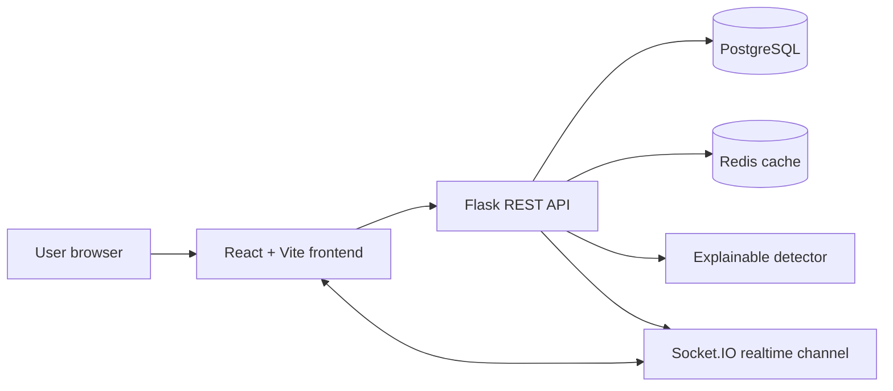

# TrustLens System Design

## Problem

TrustLens helps users and analysts report suspicious messages, receive explainable risk scoring, vote on community reports, search historical incidents, and watch new threat reports arrive in real time.

## Architecture

## Request Flow

1. A user authenticates through `/api/auth/signup` or `/api/auth/login`.
2. The frontend stores the JWT and sends it with protected write requests.
3. A submitted message is sanitized, normalized for search, scored by the detector, and persisted.
4. Dashboard cache keys are invalidated.
5. Socket.IO broadcasts the new report to connected clients.
6. Dashboard endpoints serve trending and trend data from Redis when possible.

## Data Model

- `users`: identity, email, password hash, creation timestamp.
- `submissions`: message content, normalized search text, source, category, risk score, risk level, detector reasons, vote counters, timestamp.
- `votes`: user, submission, vote type, timestamp, with uniqueness protection to prevent duplicate vote inflation.

## Detector Design

The detector is intentionally explainable. Each score contribution has a label, category, weight, and explanation. Current signals include:

- Credential and OTP requests.
- Shortened or suspicious links.
- Brand-like untrusted domains.
- Non-HTTPS links.
- Urgent payment language.
- Investment, job, delivery, and reward-bait patterns.
- High-pressure short messages.

This makes the system easier to debug and safer to discuss than a black-box score. A future ML model should be added only with labeled evaluation data, false-positive analysis, and drift monitoring.

## Scaling Plan

- Read-heavy dashboards: Redis caches trending and risk-trend responses.
- Write path: submission creation is synchronous today; enrichment can move to a queue if detector latency increases.
- Realtime fanout: Socket.IO is acceptable for small deployments; larger deployments should use Redis pub/sub or a managed realtime service.
- Database: add composite indexes for common filters such as `(category, created_at)` and `(risk_score, created_at)` if query volume grows.
- Search: current `ILIKE` search is simple and portable; move to PostgreSQL full-text search or OpenSearch when the corpus becomes large.

## Reliability

- `/health` confirms the API process is alive.
- `/ready` checks database and cache paths.
- Docker Compose starts PostgreSQL and Redis for local parity with production.
- CI runs backend tests and frontend builds on every pull request.

## Tradeoffs

- SQLite fallback makes local development easy, while PostgreSQL is the production target.
- Rules-based scoring is explainable and fast, but less adaptive than ML.
- Cached dashboard summaries improve latency, but need invalidation on submissions and votes.
- JWT access tokens keep the API stateless, but production refresh tokens or session revocation would be needed for stricter account security.
